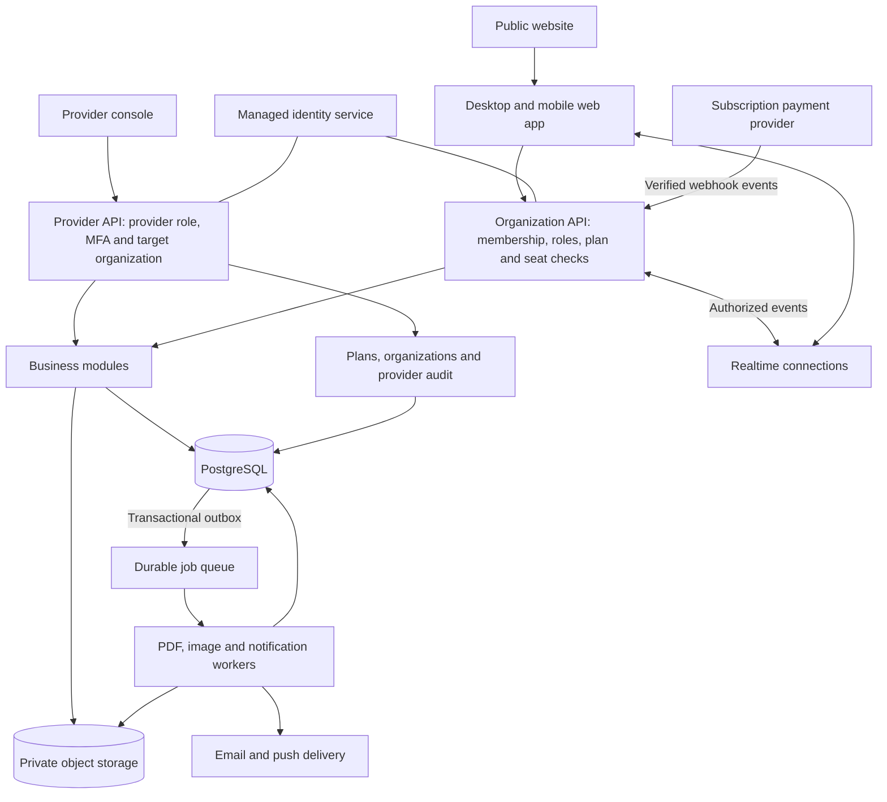

# Vayu SaaS architecture — provider-managed organizations

Status: production architecture target with a local provider/organization foundation now implemented. The provider console, scoped provider access, organization management, versioned plans, seat overrides, reserved invitations and attributed message edits are available in the isolated preview. The production authentication/MFA, PostgreSQL migration, normalized multi-organization identities, live billing, hosted storage, durable workers and realtime delivery remain pending. No Cloudflare, Wrangler, GitHub, credentials, or external accounts were accessed; nothing was deployed.

## 1. Product and tenancy model

Vayu is the software provider. Its customers are organizations, studios or stores. Each customer organization has an isolated workspace with its own subscription, employees, products, catalogs, customers, inquiries, messages, private rooms and activity history. A user can belong to several organizations with a different role in each. Subscription limits belong to the organization, not to the individual login.

The hierarchy is Provider → Organization → optional store/branch → organization members. Use one organization/workspace as the billing and data-isolation boundary. A single store needs no branch-management screen; multiple branches can be a later plan-controlled feature within that same organization. A provider account is separate from organization membership and does not consume a customer employee seat.

Keep one responsive desktop/mobile web application. An installable PWA can follow; native iOS/Android apps and desktop installers are outside this phase. A PWA must not imply that sensitive workspace data or every workflow works offline.

There are three product surfaces:

| Surface | Purpose |
| --- | --- |
| Public website | Product explanation, pricing, examples, signup, login, help, policies |
| Customer workspace | The current Vayu workflows, workspace switching, team settings, subscription and usage |
| Provider console | All organizations, plans, subscriptions, users, business records, files, messages, private rooms, activity history and service operations |

The provider owner and authorized provider super admins can view, create, edit, delete, restore and manage retained application data across all organizations. They do not need customer membership or a fresh customer approval for each action. Organization administrators remain confined to their own organization. Full provider management is an explicit application permission, separate from the database's superuser account.

## 2. System structure

Start with one backend organized into clear modules, plus independently running background workers. Keep database transactions available across business modules. Extract a module into a separate service only when measured workload or operational needs justify it.



Recommended foundation:

- Reuse the React interface and shared catalog design model; introduce TypeScript incrementally where it improves API and data contracts.
- Use a Node.js/TypeScript backend and workers to preserve compatibility with the existing JavaScript business logic and renderer.
- Replace the local SQLite state document with structured PostgreSQL tables and migrations.
- Move uploaded images, originals, edited copies, PDFs and thumbnails into private object storage. Keep file metadata and permissions in PostgreSQL.
- Use managed identity, database, object storage and a durable queue to reduce operating work. Choose providers after confirming business geography, expected usage and budget.
- Store messages durably in PostgreSQL; use WebSockets for immediate updates. Add shared publish/subscribe infrastructure when multiple API instances need to fan out events.
- Keep search in PostgreSQL initially, with workspace and permission filtering. Consider a dedicated search service only when needed.

## 3. Business modules

| Module | Responsibilities |
| --- | --- |
| Provider management | All-organization access, provider staff roles, organization suspension/recovery, plan overrides, content management and provider activity |
| Identity and workspaces | Verified login, invitations, organization membership, employee seats, organization roles, session revocation, MFA for administrators |
| Subscriptions and access | Versioned plans, subscription state, entitlements, seats, usage, quotas, upgrades and downgrades |
| Inventory and media | Products, collections, multiple images, bulk uploads, display/banner selection, image editing |
| Catalog | Library, Designer, templates, branding, drafts, immutable PDF versions, sharing and deletion |
| Customer workflow | Customer profiles, structured addresses, inquiries, camera attachments, follow-ups |
| Collaboration | Direct messages, group messages, membership, attachments, read state, private-room resources and decisions |
| Sales and delivery | Reservations, customer invoices, business payments, delivery status and proof |
| Administration | Activity history, reports, exports, trash, recovery and workspace settings |
| Background processing | PDF generation, thumbnails, image processing, reminders, notifications and cleanup |

Vayu subscription billing is separate from the invoices a workspace issues to its own customers. Taking payments on behalf of those businesses would require a separate payment architecture; it must not be silently coupled to Vayu membership checkout.

## 4. Data model and isolation

Core relationships:

```text
User ── ProviderRoleAssignment ── ProviderRole / Permission
  └── OrganizationMembership ── Organization (workspace)
                                 ├── Store/Branch (optional) / BranchAssignment
                                 ├── Invitation / SeatReservation
                                 ├── Subscription ── PlanVersion ── Entitlement
                                 ├── EntitlementOverride / ProviderAccessSession
                                 ├── UsageLedger / QuotaReservation
                                 ├── Product ── ProductImage ── File
                                 ├── Collection ── CollectionProduct
                                 ├── Catalog ── CatalogDraft
                                 │          └── CatalogVersion ── File
                                 ├── Customer ── Inquiry ── FollowUp
                                 ├── Conversation ── Participant / Message / Attachment
                                 ├── PrivateRoom ── Participant / Resource / Decision
                                 ├── Reservation / Invoice / Payment / Delivery
                                 └── AuditEvent / Job / OutboxEvent / ShareLink
```

Every workspace-owned row has a workspace ID. Composite foreign keys prevent a record in one workspace from referencing a customer, product or file in another. Global identities and plan definitions have their own access rules.

Provide two explicit authorization paths. Organization requests verify membership, organization role and resource access. Provider requests verify a server-managed provider role, MFA session, action permission and selected target organization. Both resolve the real actor on every request. A browser-supplied organization ID or an isSuperAdmin flag cannot grant privileges. Customer-facing role editors cannot read or write provider-role assignments.

Reuse business services after authorization so provider edits still validate ownership, data consistency and state transitions. Provider-wide search and reporting have their own authorized endpoints; a single record edit always carries one explicit target organization. Apply this distinction to caches, search, files, exports, live connections and queued jobs. Recheck provider permissions when jobs execute, not only when they are queued. This follows OWASP's server-side, per-request access-control guidance: [Authorization](https://cheatsheetseries.owasp.org/cheatsheets/Authorization_Cheat_Sheet.html).

Use PostgreSQL row-level security as an additional boundary. Give organization API, provider API and workers distinct least-privileged database roles. The provider path has explicit policies for authorized management; do not implement it as a blanket OR is_admin condition controllable by the client. Production application roles are not table owners, superusers or BYPASSRLS roles. Database migrations use separate credentials. Set verified actor and organization context within each transaction so pooled connections cannot reuse the preceding request's context. PostgreSQL documents row policies and bypass behavior: [Row security policies](https://www.postgresql.org/docs/current/ddl-rowsecurity.html).

Authorization rules:

```text
Organization action:
  Valid identity + active organization membership + role permission
  + resource/room permission + plan entitlement + available quota

Provider action:
  Valid provider identity + active provider role + MFA session
  + provider action permission + explicit organization/resource scope
  + normal business validation + audit attribution
```

Provider access is independent of a customer's subscription status and room membership, so the provider can help suspended or expired organizations. Billable work still records usage. A provider may deliberately grant a feature, seat or quota override; store its reason, actor, effective period and allowance rather than silently making all expensive operations unlimited.

## 5. Roles, rooms and activity history

| Role | Intended access |
| --- | --- |
| Provider owner | Full application management across all organizations, including provider staff and global settings |
| Provider super admin | Full organization data, user, subscription, message, file and room management; provider ownership transfer remains an owner action |
| Provider staff, optional | Only delegated provider functions, such as billing or support; separate from customer employee roles |
| Organization owner | Own organization's administration, subscription, team and business settings |
| Organization admin | Permitted business administration and organization activity history |
| Employee / member | Assigned organization workflows; no administrator activity-log access |
| Guest | Explicitly invited room content and permitted actions only |

For organization users, direct/group conversations and private rooms require participant membership, including for an organization administrator. Provider owner/super-admin access is an explicit exception: they can inspect message bodies, attachments, private-room resources and decisions, and manage those records through the provider console. Provider edits to messages retain the original author and add a visible provider-edit attribution and protected revision history; new provider messages are attributed to the provider rather than silently impersonating an employee.

Private means private from uninvited organization users and other customer organizations; it does not mean hidden from the provider. Make that access model clear in onboarding and room information. Use encryption in transit and at rest. This design is not end-to-end encryption that excludes the provider.

Authorize room attachments and linked resources through the participant grant or provider permission without exposing unrelated records. Revoking a participant or provider role revokes its live subscriptions and future file requests. Persist messages before announcing them; reconnecting clients fetch missed messages from durable history.

Record the real actor, actor type (provider/organization/system), organization, action, entity, timestamp, changed fields, safe before/after values, result and correlation ID. Include provider organization-entry, sensitive reads, exports and downloads as well as uploads, edits, generation, deletion, inquiry changes, user/role changes, sharing and room-membership changes. Provider changes store a reason and provider access-session reference. Record system jobs as system actors and retain the initiating user where relevant.

Write business changes and their audit entries in the same transaction. Use append-only audit permissions for application identities, monitor privileged maintenance, and provide scheduled protected exports according to retention policy. Track failed authorization and operational errors separately from the business activity feed.

The provider can inspect activity across all organizations. Organization owners/admins see their own permitted business activity, including provider changes made to their records; employees cannot browse the administrator activity feed. Customer administrators still cannot use audit details to read room content they cannot otherwise access. Keep full sensitive content in the permission-protected record/revision store, not in a broadly visible audit payload.

Detailed logging excludes passwords, session tokens, payment credentials and file bodies. Full application management does not provide plaintext password access; offer reset/revocation flows. Card secrets stay with the payment processor. Audit history itself is append-only in the application: corrections add events rather than erasing the history of provider edits. These choices retain accountability while allowing the provider to manage business data. OWASP includes administrator access, user-management changes and exports among relevant logging events: [Logging](https://cheatsheetseries.owasp.org/cheatsheets/Logging_Cheat_Sheet.html).

### Provider console layout and management flow

```text
Overview
Organizations → open organization
  Overview / Team / Stores (if enabled) / Products / Catalog
  Customers & Inquiries / Messages & Rooms / Sales & Delivery
  Activity / Subscription & Usage / Settings & Recovery
Plans & Subscriptions
Provider Team
Activity across organizations
Jobs, Storage & Service Health
Platform Settings
```

Selecting an organization opens a provider session with a persistent banner naming that organization and the acting provider. View and edit actions operate through the provider API, even when the familiar customer UI is reused. Changing organizations clears the previous organization's cached UI data. Keep any optional “view as employee” preview read-only; administrative writes keep the provider's identity.

The provider can create, suspend, reactivate and close organizations; manage their team and store assignments; view/edit/export content; delete/restore retained records; manage room participants; revoke links; adjust plans/allowances; and retry failed jobs. Suspension blocks organization users and billable scheduled work according to policy while keeping provider management available. Provider actions cannot recover permanently purged data or rewrite a payment processor's settled transaction; use recorded corrections, credits, refunds or new catalog versions where the underlying record is historical.

## 6. Plans and billing

Illustrative feature packaging, to be finalized after measuring storage and processing costs:

| Plan | Illustrative organization seats | Proposed package |
| --- | --- | --- |
| Starter | 3 | Inventory, inquiries, standard catalogs and smaller allowances |
| Growth | 10 | Starter plus direct/group messaging, private rooms and larger allowances |
| Pro | 25 | Growth plus advanced branding/templates, automation, reporting and higher limits |
| Enterprise | Custom | Pro plus negotiated limits, SSO and supported integration requirements |

The seat numbers are proposed examples, not agreed commercial limits. Store configurable maximum members, stores, storage, products, generations, rooms and guest limits with each plan. Features and usage limits are separate values.

Store feature flags and limits in versioned plan data. Avoid scattered checks against names such as “Pro.” Existing subscriptions reference an explicit plan version so editing a plan does not unexpectedly change all customers' contracts.

Employee-seat rules:

- The organization owner, administrators and active employees count toward the plan's member limit. Provider accounts do not.
- Pending employee invitations reserve seats; expiry or cancellation releases the reservation. Recheck and allocate atomically when accepting an invite to prevent concurrent oversubscription.
- One person uses one member seat per organization even if assigned to multiple stores in that organization.
- Guests have separate configurable limits and cannot receive employee capabilities without conversion to a paid member seat.
- Deactivation releases the member seat without deleting the employee's historical actions. Invitation, activation, reactivation and role changes all check limits on the server.
- During a downgrade, the owner chooses which employees remain active; do not randomly remove users or erase records. Block additional invitations while over the limit, with the effective downgrade date and required changes visible.
- Provider changes can grant an explicit seat override with a reason and optional expiry. Customer owners cannot edit their own plan limits.

Signup flow:

```text
Sign up → verify identity → create pending workspace → choose plan
→ hosted checkout → verified payment/subscription event
→ activate entitlements → invite team → use workspace
```

The browser's checkout success screen never grants paid access. Verify webhook signatures, persist an event receipt with a unique provider event ID, acknowledge durable receipt, then process asynchronously. Handle retries, duplicates and events arriving out of order; reconcile subscription state with the provider. These requirements are documented by [Stripe](https://docs.stripe.com/webhooks) and [Razorpay](https://razorpay.com/docs/webhooks/validate-test/). Integrate one provider first, selected for the registered business and target markets.

Model pending, trialing if offered, active, past due and ended access explicitly. Cancellation at period end keeps paid access until its end date. Define a visible payment-failure grace period. Downgrades block new actions that exceed limits while preserving existing data and a clear export/reduction path. Deletion follows a disclosed retention schedule, never an immediate side effect of downgrade.

Reserve storage and generation quota atomically before accepting costly work. Use a usage ledger and unique operation IDs so retries do not spend credits twice. Release reservations for failed jobs; convert successful reservations into recorded usage. Prices, numerical quotas, overages and AI credits remain product decisions.

## 7. Catalog and file pipeline

Keep the current Products → Design → Preview flow and the Library/Designer split.

Generation flow:

```text
Save design and product snapshot → validate permission and quota
→ enqueue durable job → render snapshot in worker
→ upload PDF privately → create immutable CatalogVersion
→ finalize usage → notify user → show PDF in Library
```

Pin renderer version and font assets with the design snapshot. Reuse the shared renderer in a worker with a compatible headless browser so server output follows the preview. Generation must continue if the user closes the page. Include progress, cancellation, bounded retries and an inspectable failed-job state. Recheck authorization before execution and before committing output when membership or access may have changed.

Uploads first obtain permission, size limits and a unique destination from the API. Upload to quarantine, verify actual type and file integrity, scan untrusted files, then mark them available. Keep originals, edited images and display/banner selections as distinct records. Publicly supplied PDFs must be validated before entering Library.

Private object storage can use short-lived signed URLs for scoped transfers; signed URLs remain usable until they expire or the signing credentials become invalid. See [S3 presigned URLs](https://docs.aws.amazon.com/AmazonS3/latest/userguide/using-presigned-url.html). For private-room content that requires permission checks on every request, deliver through an authenticated endpoint. Object naming is organizational, not an access-control boundary.

Public catalog sharing is an explicit action with an opaque token, expiry and revocation. A share exposes the chosen immutable version only, not its original product files or editable catalog. Revocation prevents new authorized downloads; previously downloaded files cannot be recalled.

## 8. Operations and build sequence

Use separate local, staging and production environments with separate identities, databases, storage and secrets. Production migrations, backups and restore procedures need their own restricted credentials. Add request/job tracing, error monitoring, queue failure alerts, payment reconciliation alerts and per-workspace cost visibility. Rate-limit login, invitations, uploads, generation and messages.

Define recovery objectives with the business, then enable database point-in-time recovery, object recovery/versioning and regularly tested restores. Workspace export or recovery must preserve tenancy boundaries, current permission decisions and the integrity of audit history. Define data export, account closure and retention behavior before onboarding public customers.

Build in this order:

1. **Identity and data foundation:** real login, separate provider/organization roles, provider console, organization membership, employee-seat enforcement, structured PostgreSQL schema, migration tooling and automated tests for both customer isolation and authorized provider access.
2. **Subscriptions and media:** one provider in test mode, verified webhook lifecycle, server-enforced plans/quotas, private object storage, validated uploads, immutable catalog versions and durable PDF jobs.
3. **Collaboration and operations:** durable realtime messages, participant access plus explicit provider access, attributed provider edits, notifications, complete audit instrumentation, monitoring, backups and restore drills.
4. **Public beta:** public pricing/signup, invitation and billing recovery flows, migration rehearsal with selected existing records, permission/payment/retry/load checks and a small staged customer rollout.

Migration preserves product IDs, file relationships, catalog version history and design snapshots. Rehearse counts, file checksums and tenant ownership before any cutover; never import sample identities as real paying accounts. The original application and isolated local copy remain available during migration planning.

Initial scaling keeps API replicas stateless, scales PDF/image workers by queue demand, and enforces fair per-workspace concurrency. Introduce additional services or dedicated tenant infrastructure only after usage demonstrates a need.

Before implementation, resolve the registered business/payment market, starting organization and catalog volume, hosting budget, retention requirements, whether multiple stores are needed initially, and the final employee-seat/feature packages. The approved direction is provider-managed organizations with complete provider access to application data; these remaining decisions affect sizing and pricing.
