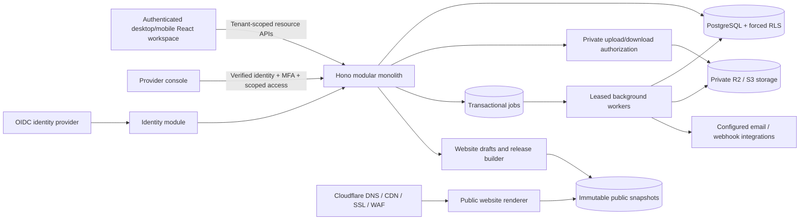

# Modular gallery SaaS

The tenant is a gallery organization. Users are identities, with separate memberships in one or more galleries. The provider control plane is independent of customer membership. Application privileges never rely on client-supplied roles or a global administrator flag.

## Code boundaries

| Area | Ownership |
| --- | --- |
| `src/core` | Configuration, transactions, cryptography, errors, migrations |
| `src/http` | Transport validation, cookies, CSRF, routes and error responses |
| `src/modules/auth` | OIDC transactions and session issuance |
| `src/modules/gallery` | Gallery data contracts and business operations |
| `src/modules/storage` | Upload intents, access authorization and S3 adapter |
| `src/modules/catalogs` | Generation requests, quotas and idempotency |
| `src/modules/jobs` | Lease handling and asynchronous handlers |
| `src/modules/website` | Safe rendering of public release data |
| `src/runtime` | Node HTTP and worker process adapters |
| `migrations` | Structured data, constraints, RLS, security-definer boundaries |
| `../src/platform-client.mjs` | Same-origin session/CSRF transport, gallery scope, cancellation and version headers |
| `../src/platform-auth.jsx` | Sign-in, invitations, organization selection and provider access |
| `../src/platform-workspace.jsx` | Paginated catalog/artwork UI, processing status and scoped component adapters |

One deployable API, one codebase and separately scaled workers. The Fetch-based HTTP layer is portable, while Node workers support native image/canvas libraries. The database adapter offers a request-local connection mode for managed serverless poolers. A Cloudflare Worker/Hyperdrive adapter and its deployment configuration are not yet wired or validated.

## Data domains

`identity`: users, sessions, login attempts. API credentials cannot issue sessions or read these tables. OIDC issuer + subject form the identity key; equal email addresses do not silently merge identities.

`control`: organizations, memberships, versioned plans, subscriptions, allowances, invitations, provider staff, provider access sessions, rate counters and audit events. Control tables are accessed through limited functions; organization and audit reads also use RLS.

`app`: artists, artworks, locations and movements, artwork media, contacts, enquiries, collections, exhibitions and junctions, offers/items, orders/items, payments, invoices, reservations, deliveries, catalogs/versions, media, spaces/messages/memberships, revision history, tasks, website drafts/releases/settings, publication selections, custom domains, API keys, webhook endpoints and usage counters.

`delivery`: durable jobs and received external webhook identities. Sensitive job payloads are excluded from HTTP status lists.

Flexible catalog design, addresses, website blocks and immutable commercial/public snapshots use JSON. They do not replace normalized relationships. All tenant relationships use composite `(tenant_id, id)` foreign keys. Money uses integer minor units with a currency code. Payment and invoice tables cannot be updated through the generic resource API.

Catalog selection is normalized in `catalog_artworks` with an explicit position. A selected catalog detail loads all of its selected artworks independently of the paginated picker, preventing saves from silently dropping selections outside the current page. Personal `catalog_drafts` carry a base version, are scoped to their editor, and cannot overwrite a saved catalog after its version changes.

The rich designer, media editor and camera components accept injected upload, render and save operations. Production media references remain stable `/api/files/<uuid>` identifiers inside a design; these are resolved only for display into authenticated, tenant-specific content routes. Storage upload/download URLs expire and never become permanent design data. Provider content requests still require a valid session and identity-bound provider access even when their context ID is supplied in the query string for an image element.

## Trust boundaries

1. Verify the opaque session in PostgreSQL. A browser-provided tenant ID, role or provider header alone grants nothing.
2. Set identity/tenant/request/provider context with transaction-local settings on one connection. Commit or rollback clears the context before a pool connection can be reused.
3. RLS checks the current session, active membership and selected tenant. Public business access is denied by default; collectors use their room grants. Cross-tenant foreign keys fail even if a relationship validation is missed in service code.
4. Provider access checks current staff status, recent MFA and an unexpired session-bound gallery access record. The provider can manage messages and rooms without joining them. Historical authorship and access attribution remain intact.
5. Each worker query requires a matching gallery/job/lease context. Stale workers cannot commit after their lease is replaced. There is no worker-wide RLS bypass exposed to the API.
6. Public websites resolve a published snapshot. Their release builder selects public fields and explicitly selected artwork media; it cannot serialize a workspace or reuse a private API response.

Private rooms are access-controlled application data, not end-to-end encrypted rooms that hide content from the provider. Tenant administrators see activity metadata, but room content and revision bodies require participation or valid provider access.

## Files and jobs

The browser receives a 60-second PUT URL for a unique quarantine key. The key is generated by the service, scoped to the gallery, and bound to size/type/checksum. Finalization queues verification. Images are decoded with a pixel limit and re-encoded without metadata; verified files receive a different private delivery key so replaying an upload URL cannot replace approved bytes. PDFs require a configured scanner. Private GET URLs last 60 seconds and are bearer credentials until expiry, including after membership changes; instant revocation requires a streaming authorization endpoint instead of a signed URL.

Business mutation and job insertion commit together. PDF generation snapshots the catalog design and selected artwork IDs; artwork/media data is loaded at job execution. The saved PDF is immutable and versioned. Edits made before a queued job executes can therefore appear in that PDF; full artwork snapshots must be added for approval/signature workflows requiring request-time freezing.

Workers use bounded leases, attempts and backoff. PDF output keys/records are deterministic per job, preventing duplicate versions after a crash. Failures are visible; unspecified external handlers do not pretend to succeed. Long-running imports and webhook dispatch still require dedicated implementations, heartbeat/timeout budgets and reconciliation.

## Scale and operations

Start with managed PostgreSQL plus a pooler, tenant-leading indexes and bounded lists. Do not open one connection pool per gallery. The Node adapter uses a bounded process pool; limit total deployment replicas against the database connection budget. Use regional placement close to PostgreSQL, private object storage and a CDN for approved website assets.

Scale workers separately from HTTP. Limit image pixels, total decoded catalog input, product/page counts and output bytes. Monitor queue age and depth per gallery. Add fairness/concurrency quotas before selling large imports; the current ordered queue does not yet provide per-tenant fair scheduling.

Partition audit/history by time after measurements justify it. Preserve tenant indexes and explicit retention policies. Add read replicas for reporting only after defining acceptable freshness and authorization consistency. There is no reason to introduce microservices for these initial modules.

## Reference documentation used

- [PostgreSQL row security](https://www.postgresql.org/docs/current/ddl-rowsecurity.html)
- [Cloudflare R2 signed URLs](https://developers.cloudflare.com/r2/api/s3/presigned-urls/)
- [Cloudflare Hyperdrive and PostgreSQL](https://developers.cloudflare.com/hyperdrive/examples/connect-to-postgres/)
- [openid-client API](https://github.com/panva/openid-client/blob/main/docs/README.md)
- [PGlite test engine](https://pglite.dev/docs/)
